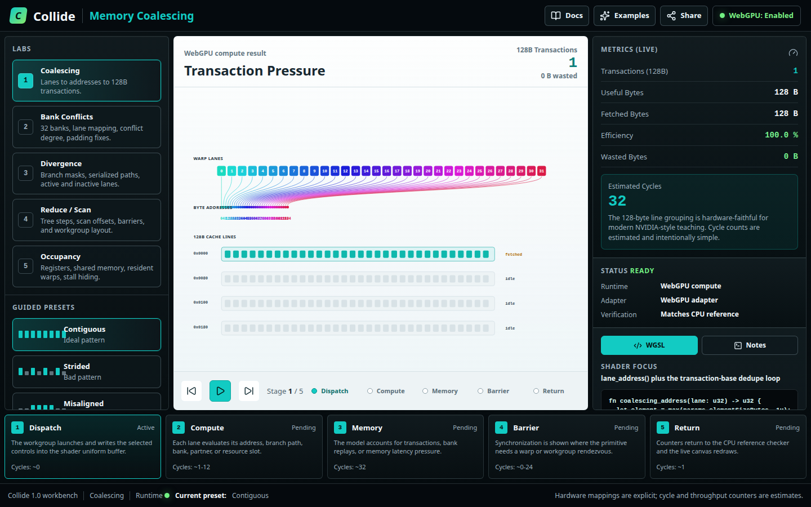
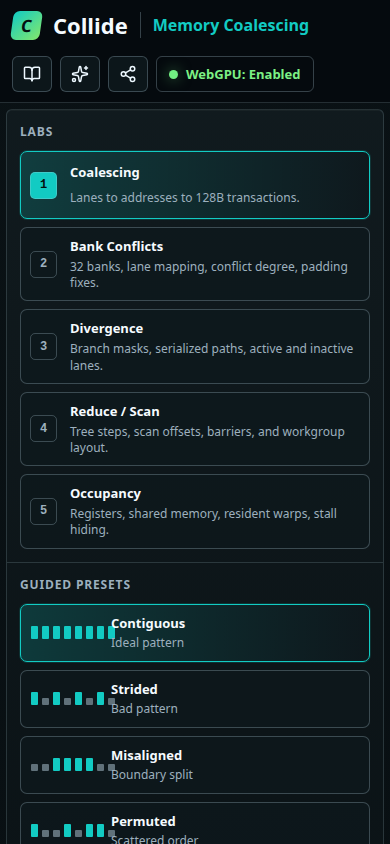

# Collide

Collide is a browser-native WebGPU teaching workbench for parallel-systems intuition. It is part GPU profiler, part interactive systems notebook: students can poke a pattern, read the WGSL, see the lane-level hardware consequence, and compare the result against a CPU reference model.

Production: [https://avifenesh.github.io/collide/](https://avifenesh.github.io/collide/)




## Labs

- Memory Coalescing: lanes to addresses to 128-byte transactions, wasted bytes, and cycle estimate.
- Shared Memory Bank Conflicts: 32 banks, lane-to-bank mapping, conflict degree, and padding fixes.
- Warp Divergence / SIMT: branch masks, serialized paths, active/inactive lanes, and branch presets.
- Reduction / Prefix Scan: tree/scan partner phases, barriers, shared memory shape, and workgroup layout.
- Occupancy / Latency Hiding: registers per thread, shared memory per block, resident warps, and throughput estimate.

## Product Shape

The first screen is the lab, not a landing page. The workbench has:

- Left rail with lab switching, guided presets, and live numeric controls.
- Central lab canvas with a different visualization for each systems concept.
- Right inspector with metrics, WebGPU status, CPU reference verification, WGSL excerpts, and model notes.
- Bottom execution timeline with dispatch, compute, memory, barrier, and return phases.
- Share URLs that encode the selected lab and control state.

## Development

```bash
npm install
npm run dev -- --host 127.0.0.1 --port 5173
```

Open `http://127.0.0.1:5173`. WebGPU requires a secure context; localhost qualifies.

## Verification

```bash
npm test
npm run lint
npm run build
npm run test:e2e
npm run test:visual
```

CI runs the same unit, lint, build, browser, and visual smoke gates.

## Browser Support

Use Chrome or Edge with WebGPU enabled for compute-backed mode. Unsupported browsers get a CPU reference fallback with a clear status explanation. See [browser support](docs/browser-support.md).

## Deployment

Collide is a static Vite app. Build with `npm run build` and serve `dist/` from an HTTPS host. WebGPU compute mode will not initialize from an insecure production origin. See [deployment](docs/deployment.md).

## Architecture And Accuracy

The CPU reference and WebGPU compute shader both emit the same `LabResult` contract. A WebGPU result is displayed only when it matches the CPU reference counters and lane records. See [architecture](docs/architecture.md) and [model honesty](docs/model-honesty.md) for what is hardware-accurate and what is estimated.
